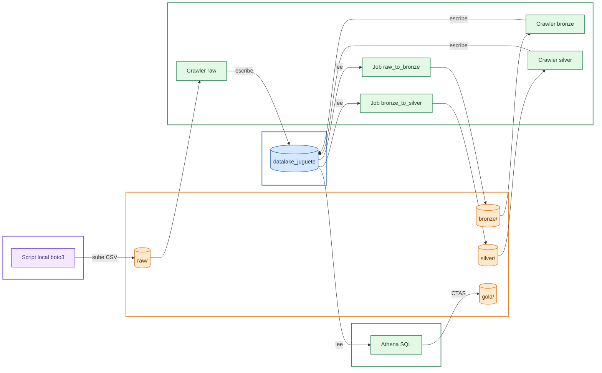

🌐 [Español](README.md) | English


# ¿What is Data Lake de Juguete (Toy Data Lake)?

Este es un repositorio cuya finalidad es aprender más sobre data lakes, en particular cómo levantar uno mediante los servicios en la nube de Amazon. La escala del data lake propuesto es increíblemente pequeño, de ahí el apodo "de juguete", y carece de aplicación real. Por tanto, sirve como ejemplo de la estructura básica que debería tener un data lake realmente funcional.

# Arquitecture

El pipeline sigue una arquitectura por capas (medallion architecture: raw → bronze → silver → gold), donde cada capa se cataloga automáticamente antes de pasar a la siguiente.

1. **Ingesta**: un script local (`upload_raw.py`) sube el CSV de origen a la capa `raw/` del bucket S3, sin transformar.
2. **Catalogación**: un Glue Crawler lee cada capa y registra su esquema como tabla en el Glue Catalog, para que pueda consultarse por nombre en lugar de por ruta S3.
3. **Transformación (bronze)**: un Glue Job lee la tabla `raw` desde el catálogo y la convierte a formato Parquet en `bronze/`.
4. **Limpieza (silver)**: un segundo Glue Job lee `bronze`, aplica reglas de limpieza (elimina nulos, valores fuera de rango y duplicados) y escribe el resultado en `silver/`.
5. **Agregación (gold)**: una consulta Athena (CTAS) agrega los datos de `silver` por categoría y región (en este caso, lo ideal es adaptarlo a los datos con los que estemos trabajando), y escribe el resultado particionado en `gold/`, listo para análisis.

Todo el proceso está automatizado con scripts Python (boto3) — no requiere pasos manuales en la consola de AWS.




# AWS Services

- [S3](https://aws.amazon.com/es/s3/) Bucket, almacenamiento por capas de nuestros datos.
- [Glue](https://aws.amazon.com/es/glue/), catálogo de datos (tablas por capas), crawlers y jobs ETL.
- [Athena](https://aws.amazon.com/es/athena/), consultas SQL (serverless).
- [IAM](https://aws.amazon.com/es/iam/), control de permisos y perfiles de trabajo.

# Repository Structure
```
DataLakeDeJuguete/
├── data/
│ └── SampleSuperstore.csv # Dataset de ejemplo (Sample Superstore)
├── infra/
│ ├── provision_infra.py # Crea el bucket S3, el rol IAM y la base de datos Glue
│ ├── deploy_crawler.py # Crawler sobre raw/
│ ├── deploy_bronze_crawler.py # Crawler sobre bronze/
│ └── deploy_silver_crawler.py # Crawler sobre silver/
├── glue_jobs/
│ ├── raw_to_bronze.py # Script PySpark: raw (CSV) -> bronze (Parquet)
│ ├── deploy_bronze_job.py # Sube y ejecuta el Job raw_to_bronze
│ ├── bronze_to_silver.py # Script PySpark: bronze -> silver (limpieza)
│ └── deploy_silver_job.py # Sube y ejecuta el Job bronze_to_silver
├── scripts/
│ ├── upload_raw.py # Sube el CSV local a S3 (raw/)
│ └── generate_gold_table.py # CTAS de Athena: agrega silver -> gold, particionado por Region
├── config.py # Configuración centralizada (nombres de recursos, región, perfil AWS)
├── requirements.txt
├── .gitignore
└── README.md
```

**Por qué esta separación:**
- **`infra/`** contiene todo lo que crea o actualiza infraestructura (recursos que persisten entre ejecuciones): bucket, rol, catálogo y crawlers.
- **`glue_jobs/`** agrupa cada transformación en pares: el script PySpark que ejecuta AWS Glue en la nube, y su script de despliegue correspondiente (sube el código a S3 y lanza el job desde tu máquina).
- **`scripts/`** son utilidades puntuales del flujo de datos que no encajan como infraestructura ni como transformación Glue (ingesta inicial, consulta final de agregación).
- **`config.py`** centraliza todos los nombres y valores de recursos (bucket, región, nombres de crawlers/jobs) en un único sitio, para no repetirlos ni tener que buscar y reemplazar en varios archivos si algo cambia.

# Executing the Scrpts

### Requirements

- Cuenta de AWS con un usuario IAM configurado localmente (perfil en `~/.aws/credentials`, gestionado aquí con la extensión AWS Toolkit para VS Code).
- El usuario IAM necesita permisos sobre S3, IAM (crear roles), Glue y Athena.
- Python 3.9+ instalado.

### Installation

```bash
python -m venv venv
venv\Scripts\activate
pip install -r requirements.txt
```

### Execution Steps

Los scripts son idempotentes (se pueden re-ejecutar sin duplicar recursos), pero deben lanzarse en este orden la primera vez:

```bash
# 1. Sube el CSV de origen a la capa raw/
python scripts\upload_raw.py

# 2. Provisiona bucket, rol IAM y base de datos Glue
python infra\provision_infra.py

# 3. Cataloga raw/
python infra\deploy_crawler.py

# 4. Transforma raw -> bronze (Parquet)
python glue_jobs\deploy_bronze_job.py

# 5. Cataloga bronze/
python infra\deploy_bronze_crawler.py

# 6. Limpia bronze -> silver
python glue_jobs\deploy_silver_job.py

# 7. Cataloga silver/
python infra\deploy_silver_crawler.py

# 8. Agrega silver -> gold (particionado por Region)
python scripts\generate_gold_table.py
```

Cada script imprime su progreso y estado (`[OK]`, `[CREANDO]`, `[EJECUTANDO]`) en la terminal.

# Dataset y Config

Este proyecto usa el dataset público **Sample Superstore** como ejemplo para validar el pipeline, ya que aún no se dispone de datos reales del proyecto con el cliente.

Todos los nombres de recursos (bucket, región, base de datos, crawlers, jobs) están centralizados en `config.py`. Para reproducir este proyecto con otra cuenta de AWS o con un dataset distinto, basta con:

1. Ajustar los valores en `config.py` (nombre de bucket único, región, nombre del perfil AWS).
2. Sustituir el CSV en `data/` por el dataset deseado.
3. Ajustar la consulta de agregación en `scripts/generate_gold_table.py` si las columnas del nuevo dataset difieren de las de Superstore.

# Notes

Como se ha mencionado anteriormente, este es un proyecto de investigación y deja mucho que desear como data lake propiamente dicho. Una versión *real* tendrá datos, que posiblemente se tengan que actulizar con frecuencia, muchos más requisitos de seguridad, y por supuesto una mayor infraestructura (IaC) que facilite el uso y la expansión del data lake.

# Credits/Licences

- [Sample Superstore Dataset](https://www.kaggle.com/datasets/bravehart101/sample-supermarket-dataset), CC0: Public Domain

