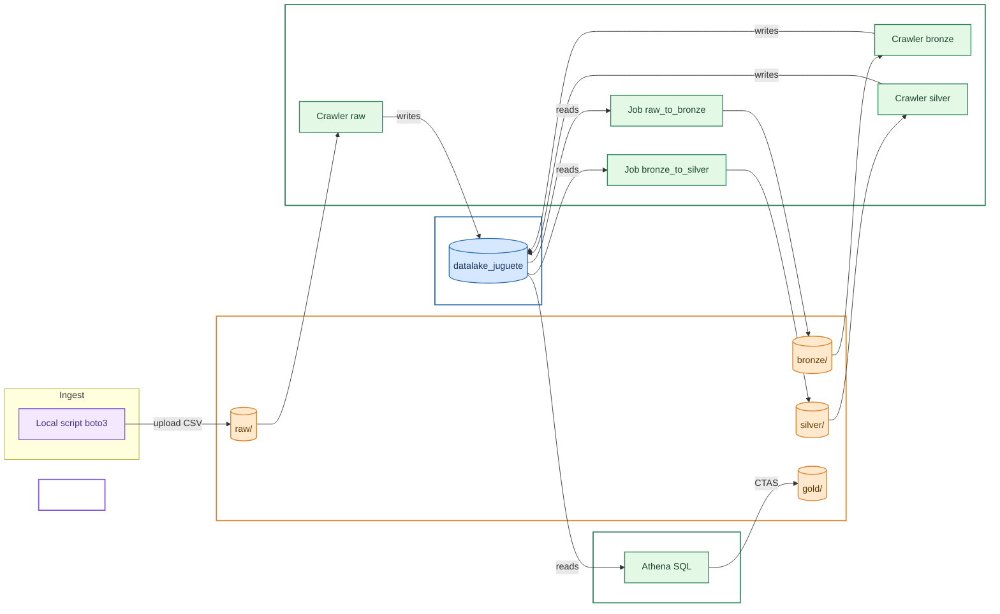

🌐 [Español](README.md) | English


# ¿What is Data Lake de Juguete (Toy Data Lake)?
This repository has the end goal to lean more about data lakes, in particular how to set one up with Amazon web services. The proposed data lake's scale is incredibly small, hence the nickname "toy", and lacks real aplication. Therefore, it serves as an exmple of the basic structure that a real functioning data lake should have.

# Arquitecture
The pipeline follows a layered arquitecture (medallion architecture: raw → bronze → silver → gold), where each layer is automatically catalogued before proceding with the next one.

1. **Ingest**: the local script (`upload_raw.py`) uploads the original CSV to the `raw/` layer inside the S3 bucket, without modifications.
2. **Catalog**: a Glue Crawler reads each layer and registers it's schema as a table inside the Glue Catalog, this way it can be searched by name instead of an S3 uri.
3. **Transformation (bronze)**: a Glue Job reads the `raw` table from the catalog and then converts it into parquet format before saving it in `bronze/`.
4. **Cleaning (silver)**: a second Glue Job reads `bronze`, applies cleaning rules (delete nulls, out of range values and duplicates) then writes it inside `silver/`.
5. **Aggregation (gold)**: an Athena query (CTAS) aggregates the `silver` data by category and region (in this case, it would be ideal to adapt it to the data we're working with), then writes the partitioned result  in`gold/`, ready to be worked with.

The process is automated via Python scripts (boto3) - it does not require to take manual steps inside the AWS console.



# AWS Services

- [S3](https://aws.amazon.com/es/s3/) Bucket, layered storage of our data.
- [Glue](https://aws.amazon.com/es/glue/), data catalog (table per layer), crawlers and ETL jobs.
- [Athena](https://aws.amazon.com/es/athena/), SQL queries (serverless).
- [IAM](https://aws.amazon.com/es/iam/), permissions manager and work profiles.

# Repository Structure
```
DataLakeDeJuguete/
├── data/
│ └── SampleSuperstore.csv # Example dataset (Sample Superstore)
├── infra/
│ ├── provision_infra.py # Creates the S3 bucket, the IAM role and Glue database
│ ├── deploy_crawler.py # Crawler at raw/
│ ├── deploy_bronze_crawler.py # Crawler at bronze/
│ └── deploy_silver_crawler.py # Crawler at silver/
├── glue_jobs/
│ ├── raw_to_bronze.py # Script PySpark: raw (CSV) -> bronze (Parquet)
│ ├── deploy_bronze_job.py # Uploads and executes the raw_to_bronze Job
│ ├── bronze_to_silver.py # Script PySpark: bronze -> silver (limpieza)
│ └── deploy_silver_job.py # Uploads and executes the bronze_to_silver Job
├── scripts/
│ ├── upload_raw.py # Uploads the local CSV to S3 (raw/)
│ └── generate_gold_table.py # Athena CTAS: aggregate silver -> gold, partitioned by Region
├── config.py # Centralized configuration (resource names, region, AWS profile)
├── requirements.txt
├── .gitignore
└── README.md
```

**Why this separation:**
- **`infra/`** contains everythong needed to create or update the infraestructure (persistent resources between execitions): bucket, role, catalog and crawlers.
- **`glue_jobs/`** groups together each transformation pair: PySpark cript thata executes AWS Glue remotely, and its corresponding deployment script (uploads the code to S3 and launches the job from the machine).
- **`scripts/`** specific pipeline utilities that don't fit  as infraestructure or Glue transformations (inicial ingest, final aggregation query).
- **`config.py`** centralizes every name and resource value (bucket, region, crawlers/jobs names) inside a single file, this way we don't have to repeat them or look for each instance qhen there's a change.

# Executing the Scrpts

### Requirements
- AWS account with a local credentials set (profile inside `~/.aws/credentials`, managed in this project by the AWS toolkit for VS Code).
- The IAM user needs permissions for S3, IAM (role creation), Glue and Athena.
- El usuario IAM necesita permisos sobre S3, IAM (crear roles), Glue y Athena.
- Python 3.9+ installed.

### Installation

```bash
python -m venv venv
venv\Scripts\activate
pip install -r requirements.txt
```

### Execution Steps

The Scripts are idempodent (they can be re-executed without doubling the resources), put the first launch must follow this order.

```bash
# 1. Upload the original CSV to the raw/ layer
python scripts\upload_raw.py

# 2. Provision bucket, IAM role and Glue's database
python infra\provision_infra.py

# 3. Catalogs raw/
python infra\deploy_crawler.py

# 4. Transforms raw -> bronze (Parquet)
python glue_jobs\deploy_bronze_job.py

# 5. Catalogs bronze/
python infra\deploy_bronze_crawler.py

# 6. Cleans bronze -> silver
python glue_jobs\deploy_silver_job.py

# 7. Catalogs silver/
python infra\deploy_silver_crawler.py

# 8. Aggregates silver -> gold (partitioned by Region)
python scripts\generate_gold_table.py
```

Each script prints its progress and status (`[OK]`, `[CREANDO]`, `[EJECUTANDO]`) in the terminal.

# Dataset y Config

This project uses the public dataset **Sample Superstore** as an example to validate the pipeline.

All resource names (bucket, region, database, crawlers, jobs) are centralized in `config.py`. To reproduce this project with a different AWS account or another dataset, you'll have to:

1. Adjust values inside `config.py` (unique bucket name, region, AWS profile name).
2. Substitute the CSV inside `data/` for the new one.
3. Adjust aggregation query `scripts/generate_gold_table.py` if the coloms are differ from the ones in Superstore.

# Notes

As previously mentioned, this is a research/learning project and falls short of what a proper data lake would look like. A *real* version would involve actual data-likely requiring frequent updates—far more stringent security requirements, and of course a more robust infrastructure (IaC) to facilitate the data lake's use and expansion.

# Credits/Licences

- [Sample Superstore Dataset](https://www.kaggle.com/datasets/bravehart101/sample-supermarket-dataset), CC0: Public Domain

