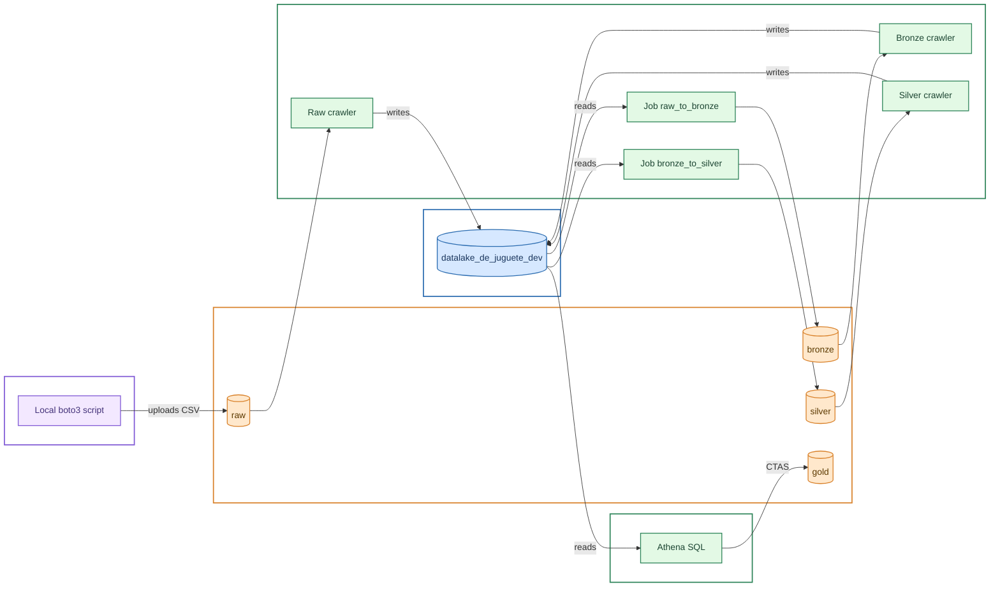

[English](README.en.md) | 🌐 [Español](README.md)
doc version 2.0

# What is the Toy Data Lake?

This repository exists to learn more about data lakes, specifically how to build one using Amazon's cloud services. The scale of the proposed data lake is intentionally tiny, hence the "toy" nickname, and it has no real-world application. It serves as an example of the basic structure a truly functional data lake should have, with the infrastructure fully automated as code (IaC).

# Architecture

The pipeline follows a layered architecture (medallion architecture: raw → bronze → silver → gold), where each layer is automatically cataloged before moving to the next. Each layer lives in its own S3 bucket.

1. **Ingestion**: a local script (`upload_raw.py`) uploads the source CSV to the `raw` bucket, untransformed.
2. **Cataloging**: a Glue Crawler reads each layer and registers its schema as a table in the Glue Catalog, so it can be queried by name instead of by S3 path.
3. **Transformation (bronze)**: a Glue Job reads the `raw` table from the catalog and converts it to Parquet format in the `bronze` bucket.
4. **Cleaning (silver)**: a second Glue Job reads `bronze`, applies cleaning rules (removes nulls, out-of-range values, and duplicates), and writes the result to the `silver` bucket.
5. **Aggregation (gold)**: an Athena query (CTAS) aggregates the `silver` data by category and region, writing the partitioned result to the `gold` bucket, ready for analysis.

The infrastructure (buckets, IAM role, database, and crawlers) is defined declaratively with **AWS CDK** and deployed with `cdk deploy` — no manual steps in the AWS console, and no imperative scripts checking "does this already exist."



# AWS Services

- [S3](https://aws.amazon.com/s3/), layered storage for our data (one bucket per layer).
- [Glue](https://aws.amazon.com/glue/), data catalog (tables per layer), crawlers, and ETL jobs.
- [Athena](https://aws.amazon.com/athena/), serverless SQL queries.
- [IAM](https://aws.amazon.com/iam/), permission control and working profiles.
- [CDK](https://aws.amazon.com/cdk/), infrastructure as code (Python).

# Repository Structure
```
DataLakeDeJuguete/
├── data/
│ └── SampleSuperstore.csv       # Example dataset (Sample Superstore)
├── infra/                       # CDK project (infrastructure as code)
│ ├── infra/
│ │ └── infra_stack.py           # S3 buckets, IAM role, Glue database and crawlers
│ ├── app.py                     # CDK app entry point
│ ├── cdk.json
│ └── requirements.txt
├── glue_jobs/
│ ├── raw_to_bronze.py           # PySpark script: raw (CSV) -> bronze (Parquet)
│ ├── deploy_bronze_job.py       # Uploads and runs the raw_to_bronze job
│ ├── bronze_to_silver.py        # PySpark script: bronze -> silver (cleaning)
│ └── deploy_silver_job.py       # Uploads and runs the bronze_to_silver job
├── scripts/
│ ├── upload_raw.py              # Uploads the local CSV to S3 (raw bucket)
│ ├── run_crawlers.py            # Starts one or more crawlers and waits for completion
│ └── generate_gold_table.py     # Athena CTAS: aggregates silver -> gold, partitioned by Region
├── requirements.txt
├── .gitignore
└── README.md
```

**Why this separation:**
- **`infra/`** is a self-contained CDK project (with its own virtual environment and dependencies) that declares all persistent infrastructure: buckets, role, catalog, and crawlers. It contains no execution logic, only the definition of the desired state.
- **`glue_jobs/`** groups each transformation in pairs: the PySpark script that AWS Glue runs in the cloud, and its corresponding deployment script.
- **`scripts/`** are data-flow and one-off execution utilities (initial ingestion, running crawlers, final aggregation query) that don't fit as declarative infrastructure.

# How to Run It

### Requirements

- AWS account with an IAM user configured locally (profile in `~/.aws/credentials`, managed here with the AWS Toolkit extension for VS Code).
- The IAM user needs permissions over S3, IAM (create roles), Glue, and Athena.
- Python 3.9+ installed.
- Node.js installed (required for the AWS CDK CLI).

### Installation

```bash
# Data project environment (repo root)
python -m venv venv
venv\Scripts\activate
pip install -r requirements.txt

# CDK CLI (once per machine)
npm install -g aws-cdk

# CDK project environment
cd infra
python -m venv .venv
.venv\Scripts\activate
pip install -r requirements.txt
```

### Execution Order

The first time, on a new account/region, you need to bootstrap CDK:

```bash
cd infra
cdk bootstrap aws://YOUR_ACCOUNT/YOUR_REGION
```

From there, the flow is:

```bash
# 1. Deploy all infrastructure (buckets, role, database, crawlers)
cd infra
cdk deploy

# 2. Upload the source CSV to the raw bucket
python scripts\upload_raw.py

# 3. Catalog raw
python scripts\run_crawlers.py raw

# 4. Transform raw -> bronze (Parquet)
python glue_jobs\deploy_bronze_job.py

# 5. Catalog bronze
python scripts\run_crawlers.py bronze

# 6. Clean bronze -> silver
python glue_jobs\deploy_silver_job.py

# 7. Catalog silver
python scripts\run_crawlers.py silver

# 8. Aggregate silver -> gold (partitioned by Region)
python scripts\generate_gold_table.py
```

To review infrastructure changes before applying them, use `cdk diff` instead of deploying directly.

# Dataset and Configuration

This project uses the public **Sample Superstore** dataset as an example to validate the pipeline.

Resource names (buckets, database, crawlers) are generated from the project name and environment (`dev` by default), defined in `infra_stack.py`. To reproduce this project with a different AWS account or a different dataset:

1. Adjust the project/environment name in `infra_stack.py` if needed.
2. Replace the CSV in `data/` with the desired dataset.
3. Adjust the aggregation query in `scripts/generate_gold_table.py` if the new dataset's columns differ from Superstore's.

# Notes

As mentioned above, this is a research project and leaves much to be desired as an actual data lake. A *real* version would have data that likely needs frequent updates, many more security requirements, and environment separation (dev/staging/prod) via CDK contexts.

# Credits/Licenses

- [Sample Superstore Dataset](https://www.kaggle.com/datasets/bravehart101/sample-supermarket-dataset), CC0: Public Domain