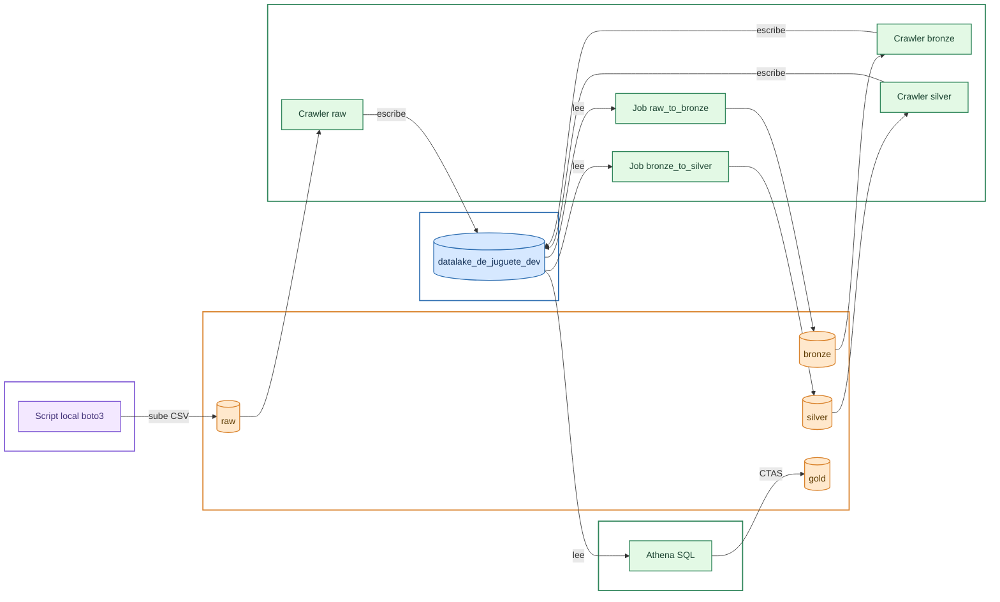

🌐 Español | [English](README.en.md)
doc version 2.0

# ¿Qué es el Data Lake de Juguete?

Este es un repositorio cuya finalidad es aprender más sobre data lakes, en particular cómo levantar uno mediante los servicios en la nube de Amazon, con la infraestructura totalmente automatizada como código (IaC). La escala del data lake propuesto es increíblemente pequeño, de ahí el apodo "de juguete", y carece de aplicación real. Por tanto, sirve como ejemplo de la estructura básica que debería tener un data lake realmente funcional.

# Arquitectura

El pipeline sigue una arquitectura por capas (medallion architecture: raw → bronze → silver → gold), donde cada capa se cataloga automáticamente antes de pasar a la siguiente. Cada capa vive en su propio bucket S3.

1. **Ingesta**: un script local (`upload_raw.py`) sube el CSV de origen al bucket `raw`, sin transformar.
2. **Catalogación**: un Glue Crawler lee cada capa y registra su esquema como tabla en el Glue Catalog, para que pueda consultarse por nombre en lugar de por ruta S3.
3. **Transformación (bronze)**: un Glue Job lee la tabla `raw` desde el catálogo y la convierte a formato Parquet en el bucket `bronze`.
4. **Limpieza (silver)**: un segundo Glue Job lee `bronze`, aplica reglas de limpieza (elimina nulos, valores fuera de rango y duplicados) y escribe el resultado en el bucket `silver`.
5. **Agregación (gold)**: una consulta Athena (CTAS) agrega los datos de `silver` por categoría y región, y escribe el resultado particionado en el bucket `gold`, listo para análisis.

La infraestructura (buckets, rol IAM, base de datos y crawlers) se define de forma declarativa con **AWS CDK** y se despliega con `cdk deploy` — sin pasos manuales en la consola de AWS y sin scripts imperativos comprobando "si ya existe".



# Servicios AWS

- [S3](https://aws.amazon.com/es/s3/), almacenamiento por capas de nuestros datos (un bucket por capa).
- [Glue](https://aws.amazon.com/es/glue/), catálogo de datos (tablas por capas), crawlers y jobs ETL.
- [Athena](https://aws.amazon.com/es/athena/), consultas SQL (serverless).
- [IAM](https://aws.amazon.com/es/iam/), control de permisos y perfiles de trabajo.
- [CDK](https://aws.amazon.com/es/cdk/), definición de la infraestructura como código (Python).

# Estructura del Repositorio
```
DataLakeDeJuguete/
├── data/
│ └── SampleSuperstore.csv # Dataset de ejemplo (Sample Superstore)
├── infra/ # Proyecto CDK (infraestructura como código)
│ ├── infra/
│ │ └── infra_stack.py # Buckets S3, rol IAM, base de datos Glue y crawlers
│ ├── app.py # Punto de entrada de la app CDK
│ ├── cdk.json
│ └── requirements.txt
├── glue_jobs/
│ ├── raw_to_bronze.py # Script PySpark: raw (CSV) -> bronze (Parquet)
│ ├── deploy_bronze_job.py # Sube y ejecuta el Job raw_to_bronze
│ ├── bronze_to_silver.py # Script PySpark: bronze -> silver (limpieza)
│ └── deploy_silver_job.py # Sube y ejecuta el Job bronze_to_silver
├── scripts/
│ ├── upload_raw.py # Sube el CSV local a S3 (bucket raw)
│ ├── run_crawlers.py # Lanza uno o varios crawlers y espera a que terminen
│ └── generate_gold_table.py # CTAS de Athena: agrega silver -> gold, particionado por Region
├── requirements.txt
├── .gitignore
└── README.md
```


**Por qué esta separación:**
- **`infra/`** es un proyecto CDK autocontenido (con su propio entorno virtual y dependencias) que declara toda la infraestructura persistente: buckets, rol, catálogo y crawlers. No contiene lógica de ejecución, solo definición del estado deseado.
- **`glue_jobs/`** agrupa cada transformación en pares: el script PySpark que ejecuta AWS Glue en la nube, y su script de despliegue correspondiente.
- **`scripts/`** son utilidades del flujo de datos y de ejecución puntual (ingesta inicial, lanzar crawlers, consulta final de agregación) que no encajan como infraestructura declarativa.

# Cómo Ejecutarlo

### Requisitos

- Cuenta de AWS con un usuario IAM configurado localmente (perfil en `~/.aws/credentials`, gestionado aquí con la extensión AWS Toolkit para VS Code).
- El usuario IAM necesita permisos sobre S3, IAM (crear roles), Glue y Athena.
- Python 3.9+ instalado.
- Node.js instalado (necesario para la CLI de AWS CDK).

### Instalación

```bash
# Entorno del proyecto de datos (raíz del repo)
python -m venv venv
venv\Scripts\activate
pip install -r requirements.txt

# CLI de CDK (una sola vez por máquina)
npm install -g aws-cdk

# Entorno del proyecto CDK
cd infra
python -m venv .venv
.venv\Scripts\activate
pip install -r requirements.txt
```

### Orden de ejecución

La primera vez, en una cuenta/región nueva, hay que hacer bootstrap de CDK:

```bash
cd infra
cdk bootstrap aws://TU_CUENTA/TU_REGION
```

A partir de ahí, el flujo es:

```bash
# 1. Despliega toda la infraestructura (buckets, rol, base de datos, crawlers)
cd infra
cdk deploy

# 2. Sube el CSV de origen al bucket raw
python scripts\upload_raw.py

# 3. Cataloga raw
python scripts\run_crawlers.py raw

# 4. Transforma raw -> bronze (Parquet)
python glue_jobs\deploy_bronze_job.py

# 5. Cataloga bronze
python scripts\run_crawlers.py bronze

# 6. Limpia bronze -> silver
python glue_jobs\deploy_silver_job.py

# 7. Cataloga silver
python scripts\run_crawlers.py silver

# 8. Agrega silver -> gold (particionado por Region)
python scripts\generate_gold_table.py
```

Para revisar cambios en la infraestructura antes de aplicarlos, usa `cdk diff` en vez de `cdk deploy` directamente.

# Dataset y Configuración

Este proyecto usa el dataset público **Sample Superstore** como ejemplo para validar el pipeline.

Los nombres de recursos (buckets, base de datos, crawlers) se generan a partir del nombre del proyecto y el entorno (`dev` por defecto), definidos en `infra_stack.py`. Para reproducir este proyecto con otra cuenta de AWS o con un dataset distinto:

1. Ajustar el nombre del proyecto/entorno en `infra_stack.py` si hace falta.
2. Sustituir el CSV en `data/` por el dataset deseado.
3. Ajustar la consulta de agregación en `scripts/generate_gold_table.py` si las columnas del nuevo dataset difieren de las de Superstore.

# Notas

Como se ha mencionado anteriormente, este es un proyecto de investigación y deja mucho que desear como data lake propiamente dicho. Una versión *real* tendrá datos que posiblemente se tengan que actualizar con frecuencia, muchos más requisitos de seguridad, y separación de entornos (dev/pre/pro) mediante contextos de CDK.

# Créditos/Licencias

- [Sample Superstore Dataset](https://www.kaggle.com/datasets/bravehart101/sample-supermarket-dataset), CC0: Public Domain