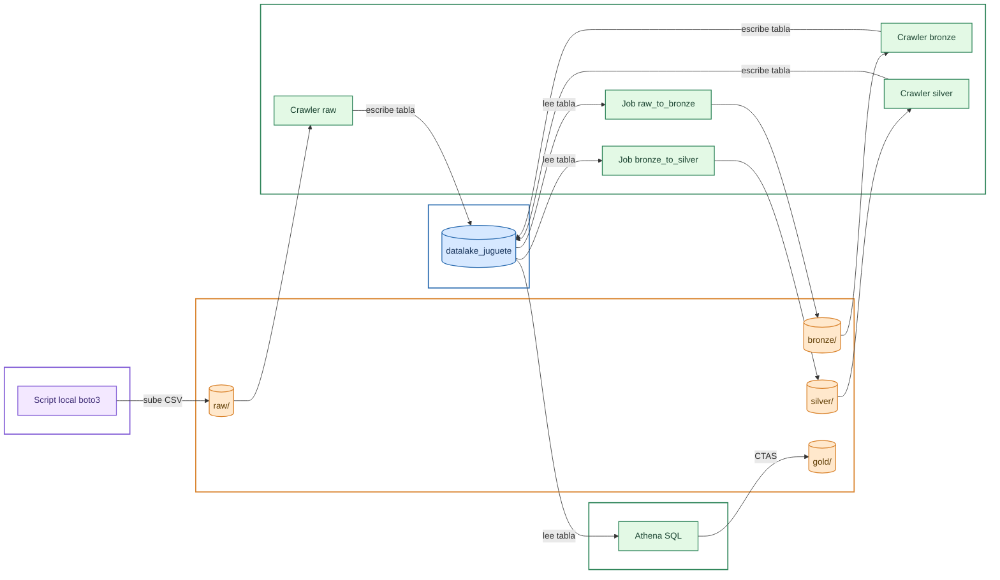

# ¿Qué es el Data Lake de Juguete?

Este es un repositorio cuya finalidad es aprender más sobre data lakes, en particular cómo levantar uno mediante los servicios en la nube de Amazon. La escala del data lake propuesto es increíblemente pequeño, de ahí el apodo "de juguete", y carece de aplicación real. Por tanto, sirve como ejemplo de la estructura básica que debería tener un data lake realmente funcional.

# Arquitectura

# Créditos/Licencias

- [Sample Superstore Dataset](https://www.kaggle.com/datasets/bravehart101/sample-supermarket-dataset), CC0: Public Domain

